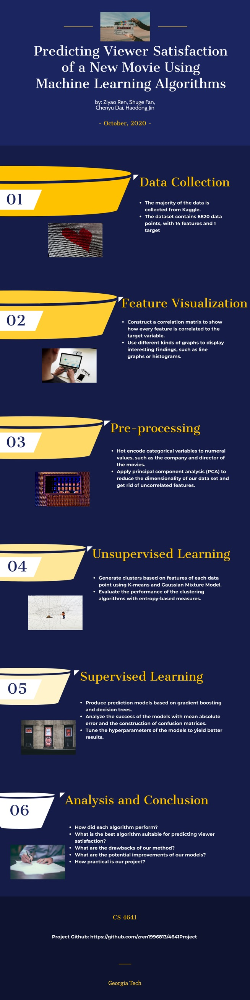
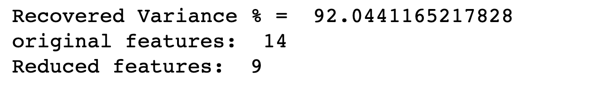
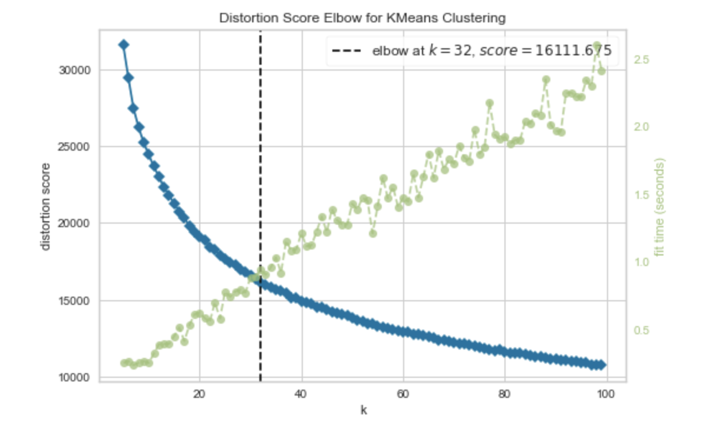

# Summary Figure
 
# Introduction/Background
The score of movies is a popular method for the audience to understand the overall quality of movies and for critics to determine whether a movie is worth recommending. With the data set found from Kaggle, this project aims to identify features of a movie that strongly correlate with its score and train the model to predict the score based on the features of a given movie. This topic is interesting and useful because we want to help producers to increase the influence of their movies just by improving the important aspects and ignoring the unrelated features. 

With the techniques and knowledge we learned from the class, including data processing, unsupervised learning, and supervised learning, we dived into the dataset and applied several tactics hoping to find some informative results by doing correlation and PCA analysis. Then, we applied two different clustering algorithms on the transformed dataset to see if movies can be categorized based on the features available. To make predictions more accurate, we seperated our dataset into two categories: training data and testing data, and used two different supervised learning algorithms to allow our model to predict scores based on features of movies. Our goal is to build a prediction algorithm that can output the range of scores that a movie would be rated at to give the producers estimate the success of their movies before releasing.

# Methods
### Data Preprocessing:

The set of data we are using contains 14 features and 6820 data points. We first remove the data points that have either 0 budget or 0 gross since we believe budget and gross are the two most important features in our machine learning process, and data points with 0 budget or 0 gross could potentially cause inaccuracy.

We also notice that there are several categorical features in our dataset, and they are hard to comply with, so we decide to expand categorical features using two encoding methods. For unsupervised learning algorithms, we used Ordinal Encoding so that each unique category value is assigned an integer value while the number of features remains the same. We used One-hot Encoding for supervised learning to expand each column into multiple boolean features for better prediction results. For example, the feature “country” with different values like “U.S, France” is separated into several new boolean features representing if the movie is made in the U.S or if the movie is made in France. After expandation, we got 3305 features. 

### Feature Reduction with matrix correlation and PCA:

To apply matrix correlation to the dataset, we need to compute the correlations among each feature, and set a threshold to delete those features which have a high correlation with other features. We decide to use a threshold of 0.7.

To apply the PCA algorithm, the first thing we want to do is to standardize the data to the same scale because some columns have bigger numbers, like the budget and gross earning columns. Those numbers are in the millions, while other columns are represented by binary numbers like 0 or 1. After data standardization, we run the PCA algorithm and transform the data into fewer dimensions.  

### K-Means and GMM:

We also want to apply K-Means algorithm and GMM algorithm to do our unsupervised learning by using the data processed by matrix correlation and PCA.

### SVM and Random Forest:
We applied SVM algorithm and Random Forest algorithm to do our supervised learning by using one-hot encoded data.

# Results
### Data Preprocessing:

After deleting the data points with 0 budget or 0 gross, we have a set of data with 14 features and 4635 data points. After the replacement of features from categorical features to boolean features, we expand our dataset from 14 features to 3305 features.

### Feature Reduction:

#### Step 1. Correlation Matrix
This is the heatmap for the correlation matrix for the original 14 features.
 
 

After plotting the heatmap, we found that the only two features that had a high correlation was the writer and the year. However, we believed that the high correlation between these two features was understable since most writers were only active for several years, and we decided to not eliminate any features based on the result of correlation matrix.
#### Step 2. PCA
After applying PCA to the dataset, we chose the first 9 principal components because they represent a total of about 90% of the cumulative variance explained, and each component has a variance bigger than 1. As a result, we reduced the number of features from 14 to 9. The following unsupervised learning algorithms are based on this reduced dataset. Below are the results: 
 
 
 
 
 
 
 

### K-Means:
We prefer to predict the score of 4.5 to 10, and each cluster represents a 0.1 score. After I apply the K Means algorithm to cluster our principal components, we evaluate the performance of Kmean from 2 to 100 clusters. As you can see in the elbow figure below, the optimal k means is 6.  
 
 
 
In order to see the diagram clearly, we decrease the range to (2,9). Apparently, The optimal cluster should be 6 which is the arm of the diagram. 
 
 
 
However, when we compute the silhouette score between 3 to 20, the score is always below 0.03 and even turns to negative values. 
 
 
 
Because 6 is the optimal cluster, we visualize the silhouette score between 4 to 8. 
 
 
 
The silhouette score is always below 0. Actually, the low silhouette score indicates there are overlapping clusters and even wrong assignments in some cases. To visualize it, the diagram is as follows:
 
 
 
We apply the optimal cluster 6 into the diagram. Unlucky, there are many clusters overlapped, the center of the clusters is pretty close to each other. In other words, it’s hard to distinguish these clusters since each cluster should keep far away from each other. Thus, based on the evaluation above, k means does not perform well in predicting scores of movies.

### GMM:
At last we applied Gaussian Mixture Models to cluster our principal components. Since the score variable that we are trying to predict lies between 4.5 to 10, we decided to evaluate the performance of GMM from 20 to 55 clusters. We hope that each of the 55 clusters would capture 0.1 range of the score. We determined that the best number of clusters would be 35, which is the joint lowest point of both Akaike information criterion and bayes information criterion.
 
 
 
We then visualize the clustering result of 39 clusters from 2D scatter plots that display only two features of a datapoint in each cluster . The following scatter plots show the clusters reduced to two different features respectively: budget to score, runtime to score, and votes to score: 
 
 
 
 
 
 
 
Since budget has the lowest correlation to score, runtime has the second lowest, and votes have the highest, the 2D scatter plots become more skewed and show a clearer curve. This is because higher correlation means the relationship between two variables are stronger. However, there are many overlapping cases because of reduced dimensionality, possibly also due to the fact that clustering algorithms do not perform well on datasets with many features.

 
To verify this, we compute the silhouette scores from 20 to 55 clusters, all of them are less than 0.03, which means that there are overlapping clusters and even wrong assignments in some cases. So we decided GMM does not perform well in predicting scores of movies. And unsupervised learning cannot cluster well due to high dimensionality of our data. 
 
 
 

### Random Forest:
To hyperparameter tuning, we used six random forests with different depths and numbers of estimators. The following tables represent the accuracy and F-1 score of each random forest. 

 
 
 
 

After comparison, we found out that the more estimators and max_depth we applied, the higher accuracy we got. It makes sense because n_estimator is the number of subtrees. More subtrees will give us better performance, thus enhancing accuracy and making our prediction stronger and more stable. As the diagram is shown above, when we increase the n_estimator, the accuracy increases. So is the max_depth. The deeper each decision tree is, the higher accuracy we can obtain since we make the analysis more specific. 

F1 score is a harmonic mean of recall and precision. It tends to favor classifiers that are strong in both precision and recall, rather than classifiers that emphasize one at the cost of the other. After we placed six different hyperparameters, we got six different F1 scores. By comparing the value, those numbers are reasonable since they are all a little higher than the accuracy, which implies that all recall values are decent. 

Therefore, we decided to use n_estimators =  100 and max_depth= 50 as our random forest moving forward. The accuracy of this random forest is 98.3%. 

To better visualize the data, we built a confusion matrix as follows:
 
 
We can tell that most of the predicted data fall into the right true data category from this confusion matrix. We also noticed that Group 3, 4, 5 has the most data. That makes sense because most of the scores of movies in our database are from 5.0 - 6.0, 6.0-7.0, 7.0-8.0. 

# Discussion
 We find out that both KMeans and GMM do not perform well on our dataset based on our results. The main reason is that our dataset has high dimensionality because we expand categorical features into multiple boolean features. For example, we have a column called 'isAmerica,' which only contains the binary number 0 and 1. This process will shorten the distance of many data points, thus becoming hard to cluster data, which is what unsupervised learning is trying to do. In other words, this would cause data overlapping. Lots of overlap will lead to a non-ideal result, as we have seen in the result section. In order to solve it, labels are required. If we label those data, we are able to recognize them easily and train them using other algorithms. Even if labeling data points would take a long time, it will increase the result's accuracy. Therefore, we believe that supervised learning algorithms would give us a better outcome instead of unsupervised learning.
  

# References
1. Muhammad Hassan Latif, Hammad Afzal, “Prediction of Movies popularity Using Machine Learning Techniques”, IJCSNS International Journal of Computer Science and Network Security, VOL.16 No.8, August 2016  

2. Nahid Quader, Md. Osman Gani, Dipankar Chaki, and Md. Haider Ali, “A Machine Learning Approach to Predict Movie Box-Office Success”, 20th International Conference of Computer and Information Technology (ICCIT), December 2017.  

3. Rebecca Eaton, “Unheard Minimalisms: The Functions of the Minimalist Technique in Film Scores”, University of Texas at Austin, May 2008  

4. Sameer Ranjan Jaiswal, Divyansh Sharma, “Predicting Success of Bollywood Movies Using Machine Learning Techniques”, Proceedings of the 10th Annual ACM India Compute Conference, Nov 2017.

